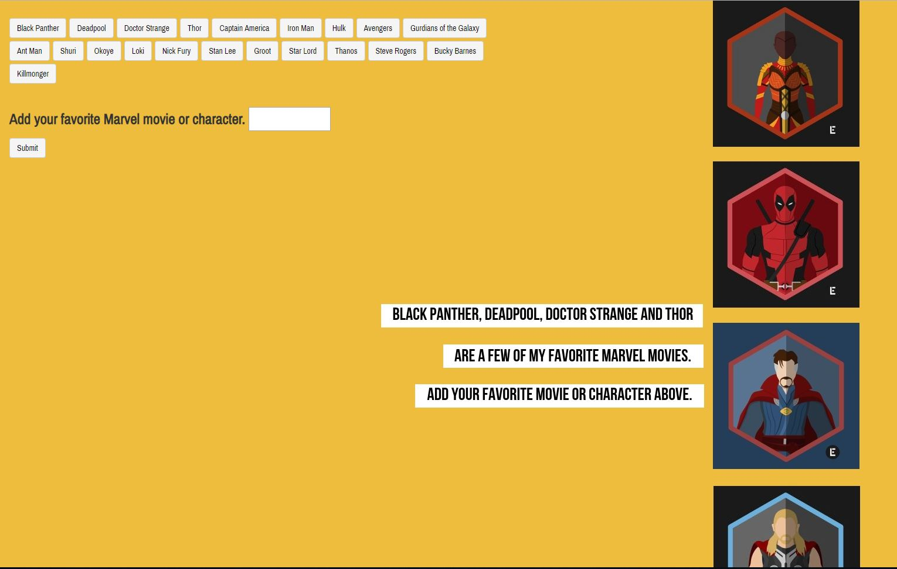

# GifTastic

Created during Week 6 of KU Coding Bootcamp, it implements the Giphy API to display Marvel characters pertaining to the button clicked. Gif’s animate when a mouse hovers over the image and allows the user to prepend new characters bases upon the entered selection.

## Getting Started
https://devans1913.github.io/gifTastic/ 

## Screen Shot

Submitting a new character will display gifs relating to that show, and append the artist selected. 

## Technologies used
- Bootstrap
- jQuery
- Giphy API

